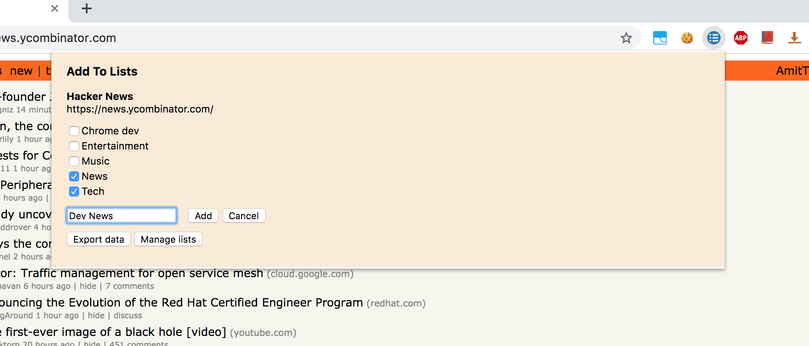
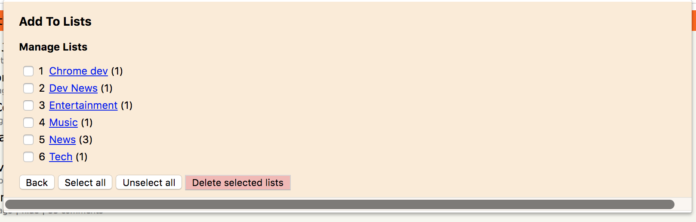
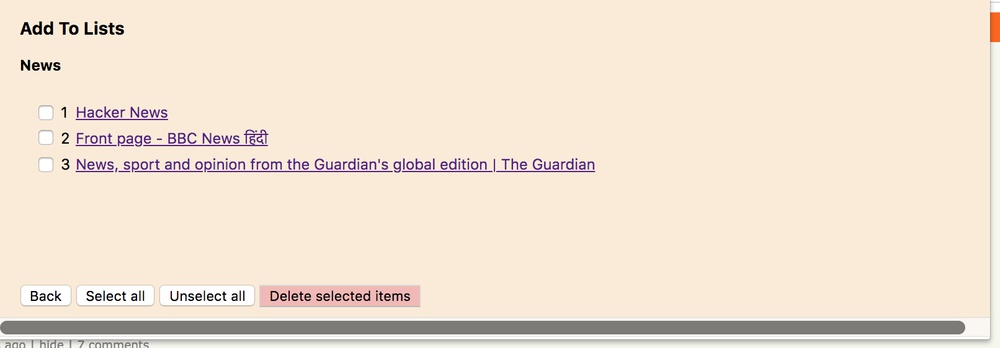

# add-to-lists-chrome-extension
A Chrome extension Add/bookmark an opened tab URL to multiple lists

### How to install
1. Clone this repo.
2. Type and enter `chrome://extensions/` in your Chrome browser's address bar or go to `Setting > More tools > Extensions`.
3. Enable the `Developer mode` at the top.
4. Click on the `Load packed` button and select the cloned repository directory.
5. If installation is successful, you'll see this icon at the top of your Chrome browser:   

### How to use
1. Go to any opened tab in your browser.
2. Click on the  icon.

#### Adding bookmark to lists 
Add the current tab's URL and name to multiple exisitng lists by checking the checkboxes or you can create a new list.

---
#### Managing lists
Just click on the `Manage lists` button and you'll be taken to list-of-lists section where you can see all the list titles with counts of bookmark items. As of now only delete is supported in the 'Manage Lists' section. Edit name will be added soon in coming release.

---

#### Bookmark lists

Click on any one list title on the 'Manage Lists' section and you'll be taken to bookmark item's list for that selected list title. You can delete the bookmarks in this section. Editing/Moving bookmark is not supported as of now, will be added soon in coming release.

### Feature Requests
Please use Issues section here on Github.

